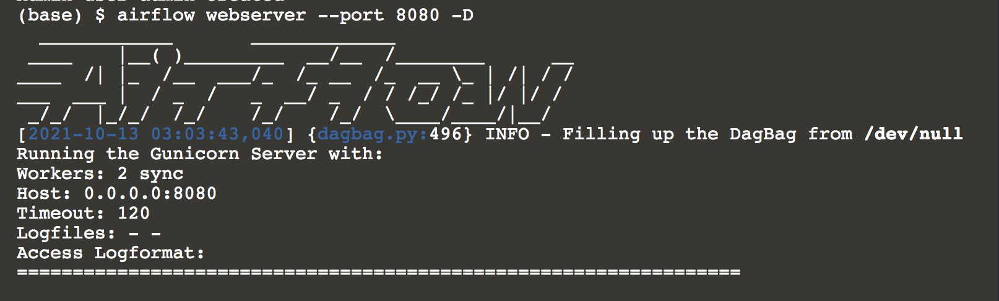

## Setting up the environment.

This first step mostly involves watching the setup process (hopefully!) carry on without incident.  

### What's happening?
A few things:  
* Installing dependencies needed for running the pipeline
* Installing Airflow
* Setting up Airflow

Setup is complete when you see the Airflow logo, which displays when starting the webserver. 

At this point you can open the Airflow UI [hosted on port 8080](https://[[HOST_SUBDOMAIN]]-8080-[[KATACODA_HOST]].environments.katacoda.com/)

user: `admin`{{copy}}  
password: `password`{{copy}}  

When you've brought up the Airflow UI you can move on to the next step.

