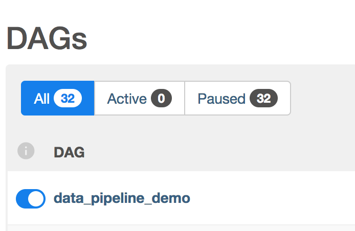

## Registering the data pipeline
Switch to the _IDE tab_. There will be a slight lag while the environment connects to the IDE port.  

In the file list under `ROOT` you will see a folder `airflow`. Under this folder open `airflow.cfg` for editing

We need to tell Airflow where to find our dag definition. Change the `dags_folder` line to:  
`dags_folder = /root/dags`{{copy}}

To the right of the _IDE Tab_ you will see a **+** sign. Click this and select "Open New Terminal"

Verify that the dag code executes without errors:
`python dags/dag.py`{{execute}} 

Now that Airflow knows where the dag files are the `data_pipeline_demo` will be present in the dag list:

`airflow dags list | grep data_pipeline_demo`{{execute}} 

You also need to reinitialize the db to include the new dag:
`airflow db init`{{execute}}

If you go back to the [Airflow UI](https://[[HOST_SUBDOMAIN]]-8080-[[KATACODA_HOST]].environments.katacoda.com/) and reload, you should now see "data_pipeline_demo" listed at the top of the dag list.  

To the left of the dag name is a grey button that pauses execution. Click the button to unpause, turning the button blue as below:

 
