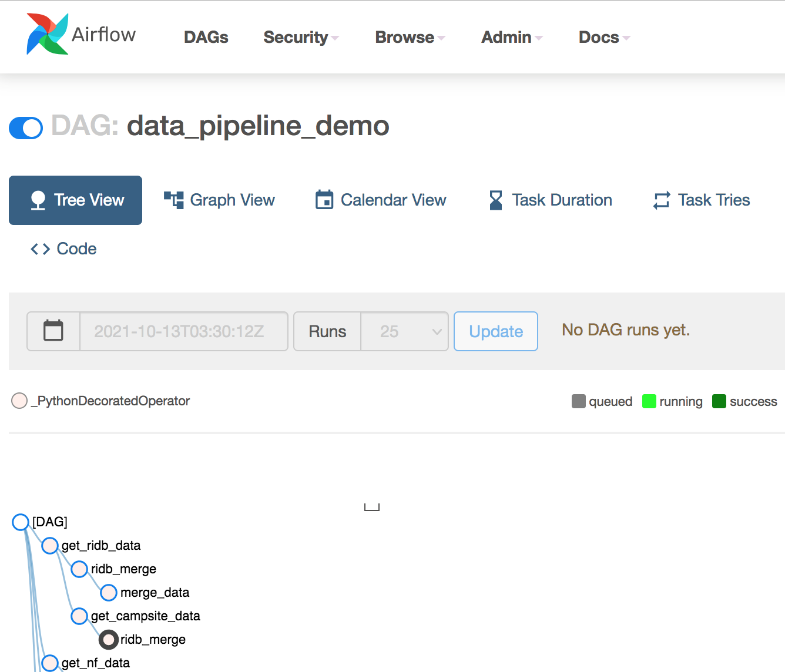

## Viewing the DAG
Recall from the Pipeline notebook how we discussed breaking up data processing into different steps. Airflow provides a helpful visualization of this.

Click on `data_pipeline_demo` to open a more detailed view:  

If you click on `Graph View` you will see the DAG displayed. The arrows indicate the flow of the graph, notice how the RIDB data acquisition and merging happens independently of the National Forest (NF) data acquisition.  

On the right side of the Graph View click `Auto Refresh`- this will enable you to watch as each task executes. 

The outline of each task will change color according to its execution status. In the next step you will trigger the DAG and observe it in progress.
